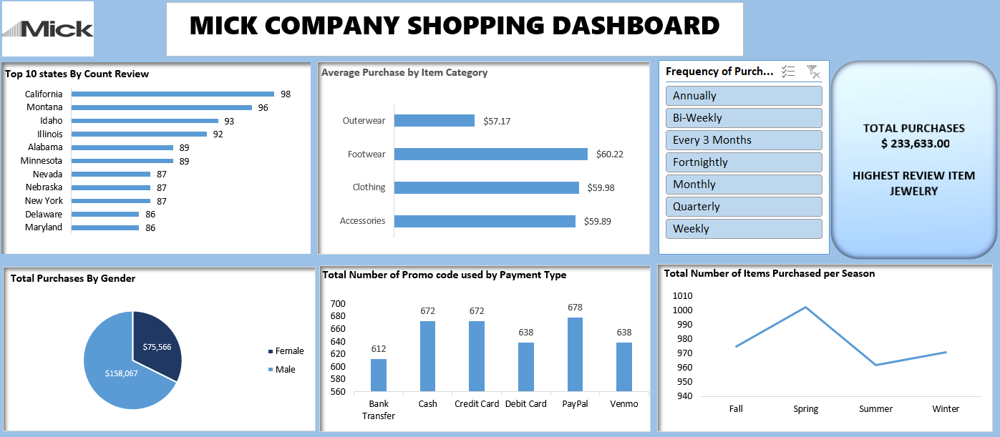

# excel-dashboard-shopping

## Introduction
This project aims to analyze and visualize the sales data from the Shopping Excel dataset to uncover trends, patterns, and insights.
The project answers crucial questions and help the company make data driven decisions.😄

**_Disclaimer_** : Datasets is just a dummy dataset to demonstrate capababilities of Microsoft Excel, It doesnt demonstrate any company. 

## Analysis
1. Data Cleaning: Preprocess the dataset to handle missing values and outliers.😫
2. Exploratory Data Analysis (EDA): Explore the data to understand its structure and relationships.
3. Visualization: Create interactive visualizations using Pivot Tables and Pivot Chart.

## PROBLEM STATEMENT
1.	What is the total Number of Promo code used by payment type?
2.	What is the total Number of Purchases made by genders?
3.	What is the total number of Purchased per season?

## Visualisation
 

## INTERACTIVITY 
😃You can interact with the report [here](excel_shopping_dashboard)

## Conclusion

-  The total number of Purchases is $233,633.00
-  Spring season has the hightest number of purchase during that period
-  Footwear has the highest average purchase in the product category.

# Thank You

